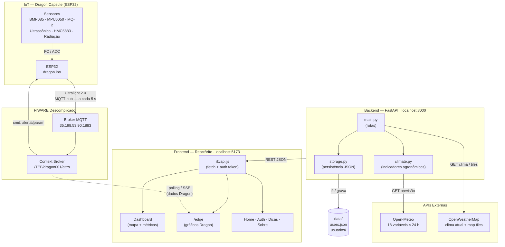
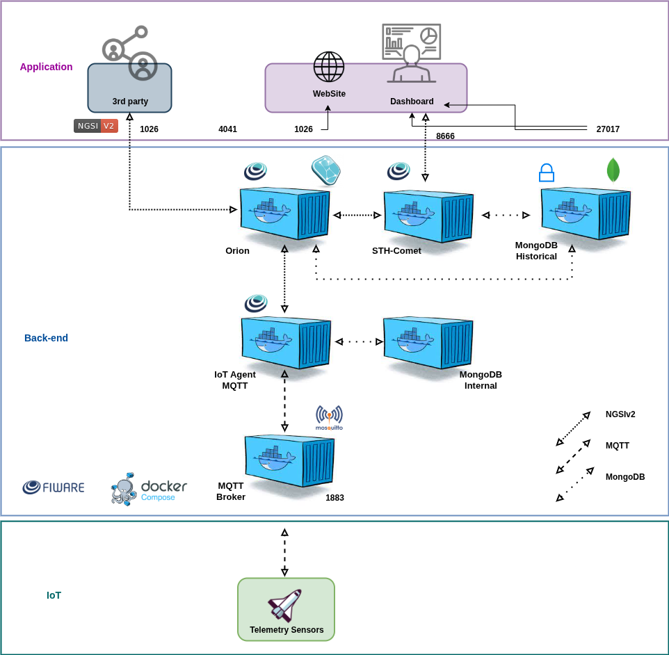

# PRADO

**Tecnologia que cultiva melhores resultados**

Plataforma agroclimática da equipe **PRADO** (Global Solution 2026 — FIAP).
Transforma dados de satélite, APIs de clima e modelos agronômicos em
recomendações práticas para pequenos e médios agricultores.

O sistema consulta a previsão meteorológica das próximas 24 horas,
processa os dados com lógica de análise de solo, irrigação, fungos,
pulverização e radiação, e entrega uma interface visual interativa com
mapas, indicadores coloridos e alertas objetivos.

---

## Sumário

- [Visão geral do sistema](#visão-geral-do-sistema)
- [Tecnologias](#tecnologias)
- [Arquitetura](#arquitetura)
- [Dragon Capsule — IoT](#dragon-capsule--iot)
- [Estrutura do repositório](#estrutura-do-repositório)
- [Fluxo de dados completo](#fluxo-de-dados-completo)
- [Pré-requisitos](#pré-requisitos)
- [Como rodar](#como-rodar)
- [Como usar](#como-usar)
- [Endpoints da API](#endpoints-da-api)
- [Indicadores agronômicos](#indicadores-agronômicos)
- [Sistema de dados](#sistema-de-dados)
- [Documentação dos submódulos](#documentação-dos-submódulos)
- [Considerações técnicas](#considerações-técnicas)
- [Integrantes](#integrantes)

---

## Visão geral do sistema

O PRADO resolve um problema concreto: produtores rurais recebem previsões
meteorológicas genéricas que não dialogam com as decisões do dia a dia
— irrigar ou esperar? Pulverizar ou adiar? Há risco de fungos?

O sistema opera em duas camadas:

1. **Backend** (Python/FastAPI): consulta APIs climáticas mundiais
   (Open-Meteo, OpenWeatherMap), processa os dados brutos com funções
   agronômicas e expõe uma API REST.

2. **Frontend** (React/Vite): consome a API e apresenta os dados em um
   mapa interativo com grade de talhões coloridos, indicadores visuais
   e cards de recomendação.

---

## Tecnologias

### Backend

| Tecnologia | Versão | Função |
|-----------|--------|--------|
| Python | 3.12 | Linguagem de programação |
| FastAPI | 0.115.6 | Framework web REST |
| Uvicorn | 0.34.0 | Servidor ASGI |
| Requests | 2.32.3 | Cliente HTTP para APIs externas |
| python-dotenv | 1.0.1 | Variáveis de ambiente |

### Frontend

| Tecnologia | Versão | Função |
|-----------|--------|--------|
| React | 19.2.6 | Biblioteca de UI |
| Vite | 8.0.12 | Bundler e dev server |
| Tailwind CSS | 4.3.0 | Framework CSS utility-first |
| React Router | 7.16.0 | Roteamento SPA |
| Leaflet / react-leaflet | 1.9.4 / 5.0.0 | Mapas interativos |
| Lucide React | 1.17.0 | Ícones |

---

## Fluxo de dados


### Papéis de cada camada

**IoT — Dragon Capsule (ESP32):**
- Lê temperatura, pressão, gás, aceleração, campo magnético, radiação e nível de propelente
- Publica telemetria via **MQTT Ultralight 2.0** a cada 5 segundos no broker FIWARE
- Recebe comandos de alerta (`alerta|temp`, `alerta|gas`, etc.) e aciona LED RGB + buzzer

**FIWARE Descomplicado:**
- Broker MQTT centraliza as mensagens do Dragon
- Context Broker armazena o estado atual de cada atributo
- Disponibiliza os dados para o frontend via polling ou SSE

**Front-end:**
- Renderiza a interface do usuário (mapas, formulários, cards)
- Gerencia sessão do usuário via `localStorage`
- Nunca chama APIs externas diretamente — toda comunicação passa pelo backend
- `/edge`: página dedicada aos gráficos em tempo real da Dragon Capsule (temperatura, pressão, gás, aceleração, radiação, propelente, campo magnético)
- Mantém dados de demonstração locais para quando o backend está offline

**Backend:**
- Atua como **proxy reverso** para APIs climáticas (protege chaves de acesso)
- **Processa** dados brutos em indicadores agronômicos
- **Persiste** dados de usuário em arquivos JSON
- **Falha graciosamente**: se uma API externa não responde, retorna dados de demonstração

---

## Dragon Capsule — IoT

O **Dragon** é um dispositivo ESP32 que atua como estação de telemetria embarcada.
Conecta-se ao broker FIWARE via MQTT (Ultralight 2.0) e publica 10 atributos a cada 5 segundos.

## Arquitetura IOT
<p align="center">
  
</p>

### Sensores e atributos publicados

| Atributo MQTT | Sensor | Descrição |
|---|---|---|
| `temp` | BMP085 | Temperatura (°C) |
| `press` | BMP085 | Pressão atmosférica (hPa) |
| `gas` | MQ-2 (analógico) | Concentração de gás (ADC 0–4095) |
| `mag` | HMC5883L | Heading magnético (°) |
| `mag_flag` | HMC5883L | Desvio > 30° da referência (0/1) |
| `rad` | I²C 0x48 | Radiação estimada (mSv/h) |
| `prop` | HC-SR04 | Nível de propelente no tanque (%) |
| `ax` / `ay` / `az` | MPU6050 | Aceleração nos 3 eixos (m/s²) |

### Alertas recebidos pelo dispositivo

O FIWARE pode enviar comandos no tópico `/TEF/dragon001/cmd` no formato `dragon001@alerta|<param>`.
O Dragon responde com LED RGB + buzzer conforme a tabela abaixo:

| Parâmetro | Cor do LED | Padrão sonoro |
|---|---|---|
| `temp` | Vermelho | Beep longo |
| `press` | Amarelo | Beep duplo |
| `gas` | Roxo | 5 beeps rápidos |
| `rad` | Branco | Beep alternado |
| `mag` | Azul | Beep curto |
| `prop` | Laranja | Beep triplo |

### Página `/edge`
Nota: ao testar, favor utilizar o ip: 34.60.152.5

A rota `/edge` do frontend exibe gráficos em tempo real com os dados publicados pelo Dragon,
consumindo o Context Broker do FIWARE via polling ou SSE. Indicado para monitoramento
contínuo da cápsula durante operação.

### Simulação Wokwi

A simulação completa dos sensores e da telemetria da nave pode ser acessada no Wokwi:

🔗 https://wokwi.com/projects/466317821989572609
---

## Estrutura do repositório

```
PRADO/
├── README.md                 ← Este arquivo (visão geral do projeto)
│
├── backend/
│   ├── README.md             ← Documentação detalhada do backend
│   ├── main.py               ← Aplicação FastAPI (todos os endpoints)
│   ├── requirements.txt      ← Dependências Python
│   ├── .env.example          ← Modelo de configuração
│   ├── services/
│   │   ├── __init__.py       ← Declaração do pacote
│   │   ├── climate.py        ← Lógica agronômica (leitura, indicadores, alertas)
│   │   └── storage.py        ← Persistência em JSON (CRUD)
│   └── data/
│       ├── users.json        ← Usuários cadastrados
│       └── usuarios/         ← Histórico, favoritos e alertas por usuário
│
├── frontend/
│   ├── README.md             ← Documentação detalhada do frontend
│   ├── package.json          ← Dependências Node.js
│   ├── vite.config.js        ← Configuração do Vite
│   ├── index.html            ← Ponto de entrada HTML
│   ├── eslint.config.js      ← Configuração do ESLint
│   └── src/
│       ├── main.jsx          ← Ponto de entrada React
│       ├── app/App.jsx       ← Componente raiz
│       ├── routes/           ← Configuração de rotas
│       ├── layouts/          ← Layout padrão (Header + Outlet + Footer)
│       ├── components/       ← Header, Footer, Mapa (reutilizáveis)
│       ├── features/         ← Páginas: home, dashboard, auth, dicas, sobre, error, edge
│       ├── lib/api.js        ← Comunicação com o backend
│       └── styles/           ← Tema Tailwind e estilos globais
│
└── docs/                     ← Documentação complementar
    ├── cores.md              ← Paleta de cores
    └── integrantes.md        ← Equipe
```

---

## Fluxo de dados completo

### 1. Usuário abre o dashboard

```
Front-end: Home → clica "Abrir dashboard"
         → RotaProtegida verifica login
         → Se não logado: redireciona para /login
         → Se logado: renderiza AgroDashboard
```

### 2. Usuário seleciona uma área

```
Opção A: clica em uma região predefinida (Ribeirão Preto, Petrolina, etc.)
Opção B: clica diretamente no mapa
       → Nominatim reverse geocoding (cidade + estado)
Opção C: botão "Minha localização"
       → navigator.geolocation API
```

### 3. Frontend busca dados climáticos

```
AgroDashboard.jsx
  → buscarClima(lat, lon, local)          ← lib/api.js
  → fetch GET /api/clima?lat=...&lon=...&token=...
```

### 4. Backend processa

```
main.py: consultar_clima()
  ├── Chama Open-Meteo (18 variáveis horárias × 24h)
  ├── Se falha → usa LEITURA_DEMONSTRACAO
  ├── climate.construir_leitura() → médias, somas, máximos
  ├── climate.calcular_indicadores() → 5 níveis de atenção
  ├── climate.gerar_alertas() → lista de alertas críticos
  └── Se usuário logado → storage persiste dados
```

### 5. Frontend renderiza resultados

```
Resposta → { leitura, indicadores, alertas, origem }
  ├── setReadings(leitura) → atualiza cards de resumo
  ├── buildMetrics(readings) → 5 cards de decisão
  ├── buildFarmData(readings) → 6 cards agrícolas
  ├── buildGridCells(...) → grade 5×5 colorida no mapa
  └── Alertas → exibidos se houver
```

---

## Pré-requisitos

- **Python** 3.10+
- **Node.js** 18+
- **Git** (opcional, para clonar)

```bash
python --version   # deve retornar Python 3.10+
node --version     # deve retornar v18+
```

---

## Como rodar

O projeto exige **dois terminais rodando simultaneamente**.
para conectar com a Dragon, utilizar o ip 34.60.152.5

### Terminal 1 — Backend

```bash
cd backend
python -m venv venv
source venv/bin/activate          # Linux/Mac
# venv\Scripts\activate           # Windows
pip install -r requirements.txt
cp .env.example .env              # configure sua chave OpenWeatherMap
uvicorn main:app --reload
```

A API sobe em `http://localhost:8000`.
Documentação interativa: `http://localhost:8000/docs`.

### Terminal 2 — Frontend

```bash
cd frontend
npm install
npm run dev
```

A interface abre em `http://localhost:5173`.

---

## Como usar

1. **Acesse** `http://localhost:5173` com os dois servidores rodando.

2. **Crie uma conta**: clique em **Entrar** (canto superior direito) e
   depois em **Criar conta**. O cadastro é imediato — nome, e-mail e senha.

3. **Explore o Dashboard**: a página principal do sistema. Selecione uma
   região predefinida ou clique no mapa para analisar qualquer ponto.

4. **Altere a camada de decisão**: os botões de Irrigação, Fungos,
   Pulverização, Solo e Radiação mudam a cor da grade de talhões no mapa.

5. **Ajuste a visualização**: raio analisado (4–16 km), opacidade da grade,
   base do mapa (comum, satélite, relevo), exibição do raio e da grade.

6. **Histórico e alertas**: a cada consulta, o backend salva automaticamente
   o histórico, os favoritos e os alertas do usuário (acessíveis pelos
   endpoints da API).

---

## Endpoints da API

| Método | Rota | Autenticação | Descrição |
|--------|------|--------------|-----------|
| `GET` | `/` | — | Status da API |
| `POST` | `/api/cadastro` | — | Cadastro de usuário |
| `POST` | `/api/login` | — | Login |
| `GET` | `/api/clima` | Opcional | Previsão 24h processada por coordenada |
| `GET` | `/api/clima-atual` | — | Clima atual de um ponto |
| `GET` | `/api/mapa/{camada}/{z}/{x}/{y}.png` | — | Tiles de chuva ou nuvens |
| `GET` | `/api/historico` | Obrigatória | Histórico do usuário |
| `GET` | `/api/favoritos` | Obrigatória | Favoritos do usuário |
| `DELETE` | `/api/favoritos/{id}` | Obrigatória | Remove favorito |
| `GET` | `/api/alertas` | Obrigatória | Alertas do usuário |

---

## Indicadores agronômicos

O sistema processa 5 indicadores principais, cada um com 3 níveis de
atenção (representados por verde/amarelo/vermelho no mapa):

| Indicador | Níveis | Base de cálculo |
|-----------|--------|----------------|
| **Irrigação** | alto / moderado / baixo | Umidade do solo, déficit de pressão de vapor (VPD), evapotranspiração |
| **Fungos** | alto / moderado / baixo | Umidade relativa, temperatura, precipitação |
| **Pulverização** | evitar / atencao / seguro | Velocidade do vento, rajadas, precipitação |
| **Solo** | seco / estavel / umido | Umidade superficial (0–1 cm) |
| **Radiação** | alto / moderado / baixo | Radiação solar direta |

Além disso, o dashboard exibe 6 leituras agrícolas complementares:
**entrada de maquinário, estresse térmico, molhamento foliar,
umidade radicular, pressão atmosférica e graus-dia** (GDD).

---

## Sistema de dados

O projeto **não usa banco SQL**. O armazenamento é feito em arquivos JSON:

```
backend/data/
├── users.json                       ← Lista de todos os usuários
└── usuarios/<email>.json           ← Dados individuais de cada usuário
```

### `users.json`

```json
[
  {
    "nome": "Felipe",
    "email": "felipe@gmail.com",
    "senha": "TEL123",
    "token": "d49f696c010b44f29a65b37131503813",
    "criado_em": "2026-06-05T19:57:06"
  }
]
```

### `<email>.json`

Cada usuário possui um arquivo individual contendo:

| Campo | Descrição | Limite |
|-------|-----------|--------|
| `historico` | Últimas consultas realizadas | 50 registros |
| `favoritos` | Locais analisados (adição automática) | Ilimitado |
| `alertas` | Alertas gerados nas consultas | 50 registros |

> **Atenção:** senhas armazenadas em texto puro (projeto acadêmico).
> Para produção, utilize bcrypt ou argon2.

---

## Documentação dos submódulos

Cada parte do projeto possui seu próprio README com documentação
detalhada:

- **`backend/README.md`** — arquitetura da API, endpoints, fluxo de
  consulta climática, módulo `climate.py` (funções, indicadores,
  alertas), módulo `storage.py` (persistência JSON), estrutura dos
  dados, autenticação, tratamento de erros.

- **`frontend/README.md`** — arquitetura SPA, estrutura de diretórios,
  árvore de componentes, fluxo de dados (requisição climática,
  autenticação, mapa), rotas, autenticação e sessão, estilização
  Tailwind, detalhes dos componentes principais (AgroDashboard,
  Header, Mapa).

---

## Considerações técnicas

### Por que FastAPI + React?

A combinação é moderna, bem documentada e adequada ao porte do projeto.
FastAPI oferece validação automática e documentação interativa sem
esforço extra. React com Vite proporciona desenvolvimento rápido com
HMR e um ecossistema maduro de bibliotecas (Leaflet, React Router,
Tailwind).

### Por que JSON em vez de SQL?

- Configuração zero: não requer instalação de banco ou migrations.
- Transparência total: qualquer editor abre e inspeciona os dados.
- Volume compatível: um projeto acadêmico gera dezenas, não milhares
  de registros por usuário.

### Segurança

- A chave da OpenWeatherMap vive apenas no `.env` do backend, nunca
  exposta ao front-end.
- CORS liberado (`*`) para facilitar o desenvolvimento local — em
  produção, restrinja à origem do front-end.
- Autenticação por token UUID (suficiente para o escopo acadêmico;
  JWT seria o recomendado em produção).

### Resiliência

- Se a Open-Meteo falhar, o backend retorna dados de demonstração.
- Se o backend estiver offline, o front-end usa um fallback local.
- Arquivos JSON corrompidos não derrubam o servidor.

---

## Integrantes

| Nome | Função | RM |
|------|--------|--------|
| Gabriel Ardito | Desenvolvimento | RM568318 |
| Felipe Menezes | Desenvolvimento | RM566607 |
| João Sarracine | Desenvolvimento | RM568318 |
| João Gonzales | Desenvolvimento | RM568166 |
| Roger Paiva | Desenvolvimento | RM566949 |

---

> Projeto desenvolvido para a **Global Solution 2026** — FIAP.
> Todos os direitos reservados.
